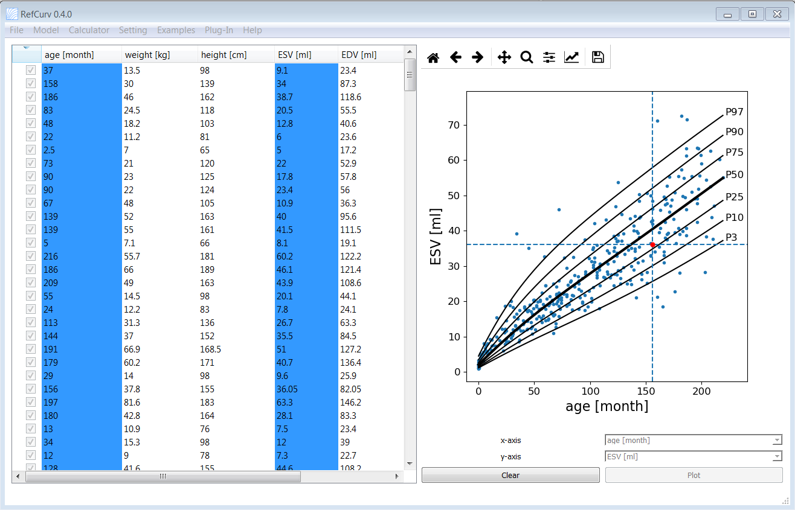

# RefCurv

RefCurv is a software providing methods to create pediatric reference curves from data. Furthermore, it comes with a big number of features to analyze reference curves. The graphical user interface (GUI) is written in Python. RefCurv uses R and the [GAMLSS](https://en.wikipedia.org/wiki/Generalized_additive_model_for_location,_scale_and_shape) add-on package as the underlying statistical engine.

## Example

Following figure shows example reference curves for Body Mass Index (BMI) over age:

The curves are based on a dataset of [healthy Dutch boys](https://rdrr.io/cran/gamlss.data/man/dbbmi.html).
RefCurv was used to fit a model to the data points and depict it in form of percentile curves. The labels indicate the percentiles, e.g. "P3" stands for the third percentile.

## Overview

## Acknowledgements
This study is funded by Fördergemeinschaft Deutsche Kinderherzzentren e.V.

## References

- [Cole, T.J. (1990).
The LMS method for constructing normalized growth standards. European Journal of Clinical Nutrition, 44, 45-60. ](https://www.ncbi.nlm.nih.gov/pubmed/2354692)
- [Rigby R.A. and Stasinopoulos D.M. (2005).
Generalized additive models for location, scale and shape, Appl. Statist., 54, part 3, pp 507-554. ](https://rss.onlinelibrary.wiley.com/doi/10.1111/j.1467-9876.2005.00510.x)
- [gamlss package (CRAN)](https://CRAN.R-project.org/package=gamlss)
- [gamlss example dataset of Dutch boys](https://rdrr.io/cran/gamlss.data/man/dbbmi.html)
- [Website of the GAMLSS developers](https://www.gamlss.com/)
- [GAMLSS on Wikipedia](https://en.wikipedia.org/wiki/Generalized_additive_model_for_location,_scale_and_shape)
